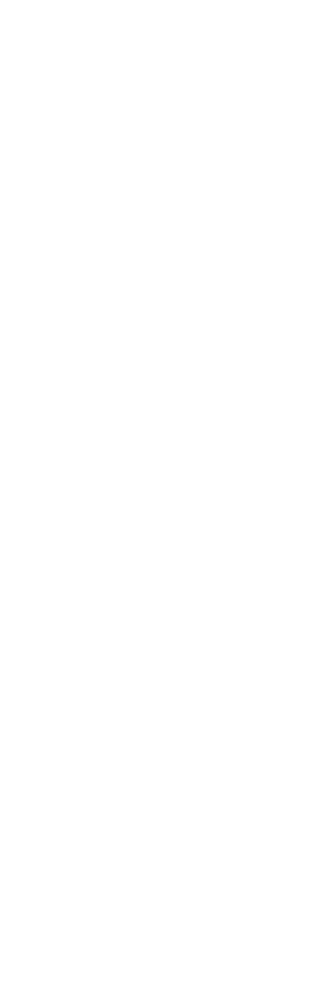
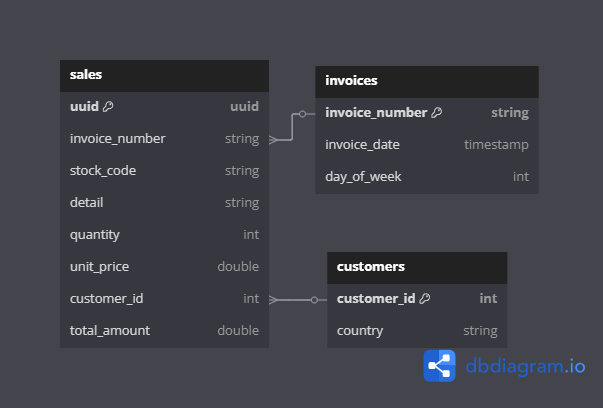

# S3 Data Pipeline with Airflow

This project demonstrates a simple data pipeline using Airflow to process user purchase data from Amazon S3.

## Architecture

The pipeline follows this architecture:


<br><br><br>
Files written into the `gold` layer follow this schema:


## Setup

### Prerequisites

* [git](https://git-scm.com/book/en/v2/Getting-Started-Installing-Git)
* [GitHub account](https://github.com/)
* [Docker](https://docs.docker.com/engine/install/) and [Docker Compose](https://docs.docker.com/compose/install/) (4GB+ RAM recommended)
* AWS account with S3 and IAM access (free trial is ok. But even if you don't have one, costs will be very low...)

### 1. Airflow Environment (Docker)

This setup is based on [beginner\_de\_project](https://github.com/josephmachado/beginner_de_project) by josephmachado.

1.  Clone the repository:

    ```bash
    git clone https://github.com/bernasiakk/Playing-with-files-on-S3-using-Airflow.git
    cd Playing-with-files-on-S3-using-Airflow
    ```

2.  Start Airflow:

    ```bash
    make up
    sleep 30 # Wait for Airflow to start
    make ci # Run checks and tests
    ```

### 2. AWS Setup

#### a. Create S3 Buckets

1.  In the AWS Console, navigate to S3.
2.  Create two buckets: one for the source data and one for the "bronze" and "silver" layers.
3.  Note the bucket names.

#### b. Create IAM User

1.  In the AWS Console, navigate to IAM.
2.  Create a new user with "Programmatic access".
3.  Attach the `AmazonS3FullAccess` policy.
4.  Save the Access Key ID and Secret Access Key.

### 3. Airflow Setup

#### a. Configure Airflow connection
1.  Open the Airflow UI (http://localhost:8080, login: `airflow`/`airflow`).
2.  Go to `Admin` -> `Connections`.
3.  Add a new connection:
    * **Connection ID:** `s3_conn`
    * **Connection Type:** `Amazon Web Services`
    * **Login:** `<Your Access Key ID>`
    * **Password:** `<Your Secret Access Key>`
4.  Save the connection.

### 4. Code Setup

Update `source_bucketname` and `sink_bucketname` in `s3_bronze.py`/`s3_silver.py`/`s3_gold.py` with your S3 bucket names.

## Usage

1.  Upload `user_purchase1000_{ddmmyyyy}.csv` to your source S3 bucket.
2.  In the Airflow UI, navigate to `DAGs` -> `s3_bronze`.
3.  Trigger the DAG (`Run DAG`).

**Note:** The DAG is designed to wait for the data file to be present in the source bucket before proceeding. You can experiment with uploading the file after triggering the DAG to observe this behavior.

## Future Improvements (TODO)
1. Set up `source_bucketname` and `sink_bucketname` as Airflow variables
2. Add the following checks
   1. Check if all items from an invoice_number are always written on the same day
   ```python
   grouped_df = df.groupby('invoice_number')\
    .agg(
        F.count_distinct(F.col('invoice_date')).alias('unique_dates')
    )\
    .filter(
        F.col('unique_dates') != 1
    )
    ```
    
   2. check if 1 stock_code = 1 detail
   ```python
   grouped_df = df.groupby('stock_code')\
    .agg(
        F.count_distinct(F.col('detail')).alias('unique_details')
    )\
    .filter(
        F.col('unique_details') != 1
    )
    ```
